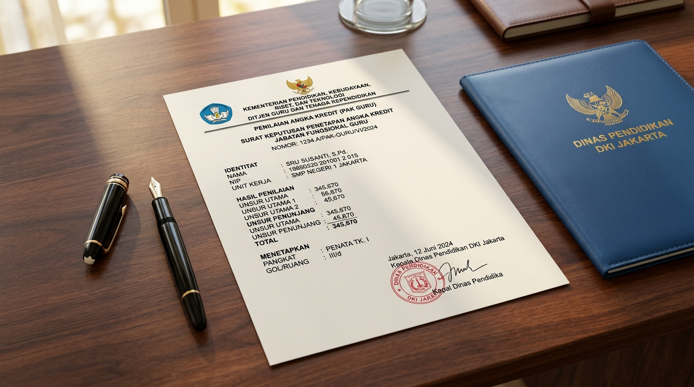

# SIPAK-GURU Hub 🎓💼
> **Sistem Integrasi Penilaian & Angka Kredit Guru PNS Berbasis Permenpan RB No. 1 Tahun 2023**  
> *Cabang Dinas Pendidikan Wilayah XIII Dinas Pendidikan Provinsi Jawa Barat (Ciamis, Banjar, Pangandaran)*


---

## 🌟 Visualisasi Dokumen Resmi & Antarmuka Sistem

<div align="center">
  
  <p style="margin-top: 8px; font-size: 13px; color: #64748b; font-style: italic;">
    Dokumen Penetapan Angka Kredit (PAK Konversi) resmi berstandar BKN & Pemerintah Provinsi Jawa Barat, siap cetak dengan Kop Surat Dinas dan spesimen Tanda Tangan Elektronik (TTE).
  </p>
</div>

---

## 📌 Tentang SIPAK-GURU Hub

**SIPAK-GURU Hub** adalah platform administrasi kepegawaian modern yang dirancang khusus untuk memfasilitasi proses penghitungan, konversi, rekapitulasi, dan pencetakan **Penetapan Angka Kredit (PAK)** bagi **Guru Pegawai Negeri Sipil (PNS)** di lingkungan **Cabang Dinas Pendidikan Wilayah XIII Dinas Pendidikan Provinsi Jawa Barat** (meliputi Kabupaten Ciamis, Kota Banjar, dan Kabupaten Pangandaran).

Aplikasi ini disesuaikan sepenuhnya dengan regulasi nasional terbaru:
1. **PERMENPAN RB Nomor 1 Tahun 2023** tentang Jabatan Fungsional.
2. **Peraturan BKN Nomor 3 Tahun 2023** mengenai Tata Cara Penyesuaian Angka Kredit dan Konversi Predikat Kinerja SKP.
3. **Surat Edaran Bersama Mendikbudristek & Kepala BKN** mengenai Konversi Angka Kredit Jabatan Fungsional Guru.

Sistem ini mentransformasikan mekanisme lama penghitungan butir kegiatan manual (*DUPAK*) menjadi **Konversi Predikat Kinerja Tahunan/Periodik (E-SKP)** secara otomatis, presisi, transparan, dan terintegrasi dengan basis data **MySQL XAMPP**.

---

## 🛠️ Arsitektur & Spesifikasi Teknologi (Tech Stack)

Aplikasi dibangun dengan arsitektur **Full-Stack (Client + Server REST API)** yang efisien, mandiri, dan andal:

*   **Frontend**: `React 18` + `TypeScript` + `Vite` untuk performa render kilat dan *type safety*.
*   **Styling & UI**: `Tailwind CSS` utility classes, responsif di seluruh resolusi layar, dengan rasio kontras warna standar aksesibilitas WCAG AA.
*   **Backend Server**: `Express.js` dengan runtime `Node.js` (`server.ts`) yang menyediakan RESTful API terstruktur.
*   **Database Engine**: **MySQL / MariaDB (XAMPP)**
    *   Menggunakan skema terstruktur di file `database.sql`.
    *   Mendukung *auto-bootstrap*: database `sipak_guru_db` dan seluruh tabel otomatis dibuat ketika server terhubung pertama kali.
    *   *Offline Local Fallback*: Ketika XAMPP belum aktif, sistem tetap dapat beroperasi menggunakan media penyimpanan lokal fallback tanpa hambatan.
*   **Ekspor Dokumen**: Menggunakan `html2pdf.js`, `jspdf`, dan `html2canvas` untuk menghasilkan dokumen PDF berstandar cetak A4/F4 resmi dinas.
*   **Ikonografi & Notifikasi**: `Lucide React` untuk ikon antarmuka bersih dan `SweetAlert2` untuk dialog konfirmasi operasional yang aman.

---

## 👥 Hak Akses & Peran Pengguna (Role-Based Access)

Sistem mengadopsi isolasi data multi-tenant demi menjaga privasi dan integritas data guru:

| Peran | Otoritas & Lingkup Kerja | Akun Bawaan |
|---|---|---|
| **Super Admin** | Akses rekap seluruh sekolah se-KCD Wilayah XIII, manajemen sekolah, audit log sistem, backup/restore database. | `admin` / `adminpaskonversi` |
| **Admin SMAN 2 Ciamis** | Mengelola data guru dan SKP khusus lingkup SMAN 2 Ciamis, konfigurasi Kop & TTE sekolah. | `sman2ciamis` / `sman2ciamis123` |
| **Admin SMAN 1 Ciamis** | Mengelola data guru dan SKP khusus lingkup SMAN 1 Ciamis, konfigurasi Kop & TTE sekolah. | `sman1ciamis` / `sman1ciamis123` |

---

## 🚀 Fitur-Fitur Unggulan

### 1. Pangkalan Data Guru PNS & Berkas Digital
*   Pencatatan profil guru komprehensif: NIP, Karpeg, Pangkat/Golongan ruang aktif, TMT, Unit Kerja, dan Angka Kredit Integrasi 2022.
*   Tautan dokumen digital awan (Google Drive, Cloud Storage) untuk SK Pangkat terakhir, PAK Integrasi 2022, dan Ijazah peningkatan pendidikan.
*   Fitur **Impor Data Massal via CSV** untuk registrasi cepat data guru satu sekolah.

### 2. Konversi Predikat SKP ke Angka Kredit (Permenpan RB 1/2023)
*   Mendukung evaluasi tahunan penuh (12 bulan) maupun periodik bulanan fleksibel.
*   Perhitungan koefisien otomatis berdasarkan jenjang jabatan guru:
    *   *Ahli Pertama* (Gol. III/a – III/b): Koefisien 12.5 / tahun
    *   *Ahli Muda* (Gol. III/c – III/d): Koefisien 25.0 / tahun
    *   *Ahli Madya* (Gol. IV/a – IV/c): Koefisien 37.5 / tahun
    *   *Ahli Utama* (Gol. IV/d – IV/e): Koefisien 50.0 / tahun
*   Pengali persentase predikat kinerja: Sangat Baik (150%), Baik (100%), Butuh Perbaikan (75%), Kurang (50%), Sangat Kurang (25%).

### 3. Ekspor & Cetak Lembar Dokumen Resmi Penetapan Angka Kredit (PAK)
*   Format cetak dokumen resmi: **Konversi Predikat Kinerja**, **Akumulasi Angka Kredit**, dan **Penetapan Angka Kredit (PAK Konversi)**.
*   Kustomisasi Kop Surat Resmi (Pemerintah Provinsi Jawa Barat / Satuan Pendidikan) dengan nomor surat dinas, tempat, dan tanggal penetapan.
*   Integrasi spesimen **Tanda Tangan Elektronik (TTE)** Kepala Sekolah (definitif/Plt/Plh) maupun Kepala Cabang Dinas.

### 4. Simulasi Kalkulator Kenaikan Pangkat
*   Menghitung proyeksi ketercapaian angka kredit kumulatif menuju jenjang atau pangkat berikutnya.
*   Indikator status kelayakan kenaikan pangkat secara *real-time* dan rincian kekurangan angka kredit yang harus dipenuhi.

### 5. Manajemen Cadangan & Audit Log
*   Ekspor dan impor cadangan database utuh dalam format JSON.
*   Audit log aktivitas pencatatan sistem (pembuatan data guru, penambahan SKP, perubahan profil, dan penghapusan data).

---

## 🗄️ Struktur Tabel Basis Data MySQL (`sipak_guru_db`)

Database dibangun menggunakan skema relasional di file `database.sql`:

```text
sipak_guru_db
  ├── schools          # Data satuan pendidikan se-KCD Wilayah XIII (NPSN, Alamat, Kepala Sekolah)
  ├── app_users        # Data kredensial pengguna, peran, dan asosiasi sekolah
  ├── teachers         # Data profil guru PNS, jabatan, golongan ruang, dan dasar AK
  ├── evaluations      # Riwayat evaluasi SKP, predikat, koefisien, dan perolehan AK
  ├── kop_settings     # Konfigurasi tata letak kop surat, nomor naskah, dan TTE pejabat
  └── system_logs      # Catatan audit aktivitas operasional dan keamanan sistem
```

---

## 💻 Panduan Menjalankan dengan MySQL XAMPP

Aplikasi ini dirancang untuk bekerja secara lokal bersama bundel server **XAMPP** di Windows maupun macOS.

### 1. Menyiapkan XAMPP
1. Buka aplikasi **XAMPP Control Panel**.
2. Nyalakan modul **Apache** dan **MySQL** (pastikan port `3306` aktif dan berstatus *Running*).
3. Buka peramban dan akses `http://localhost/phpmyadmin`.

### 2. Mengimpor Skema Basis Data
1. Pada phpMyAdmin, buat database baru bernama `sipak_guru_db` (atau biarkan backend membuatnya secara otomatis).
2. Klik tab **Import**, pilih berkas `database.sql` yang berada di direktori proyek ini, lalu klik **Go**.
3. Seluruh tabel beserta data inisial instansi sekolah dan akun administrator akan siap digunakan.

### 3. Menjalankan Aplikasi
1. Buka terminal di folder proyek:
   ```bash
   npm install
   ```
2. Jalankan server aplikasi:
   ```bash
   npm run dev
   ```
3. Buka browser pada alamat:
   ```
   http://localhost:3000
   ```
4. Masuk menggunakan akun administrator yang tersedia:
   *   **Username**: `admin`
   *   **Password**: `adminpaskonversi`

---

## 🏛️ Penyelenggara & Wilayah Kerja

Sistem ini didedikasikan untuk mendukung tata kelola administrasi kepegawaian modern bagi seluruh Guru Pegawai Negeri Sipil di bawah naungan:

**Pemerintah Daerah Provinsi Jawa Barat**  
**Dinas Pendidikan Provinsi Jawa Barat**  
**Cabang Dinas Pendidikan Wilayah XIII**  
*(Wilayah Pelayanan: Kabupaten Ciamis, Kota Banjar, Kabupaten Pangandaran)*  

*Mewujudkan Layanan Kepegawaian Pendidikan Jawa Barat yang Akuntabel, Cepat, dan Istimewa.*
